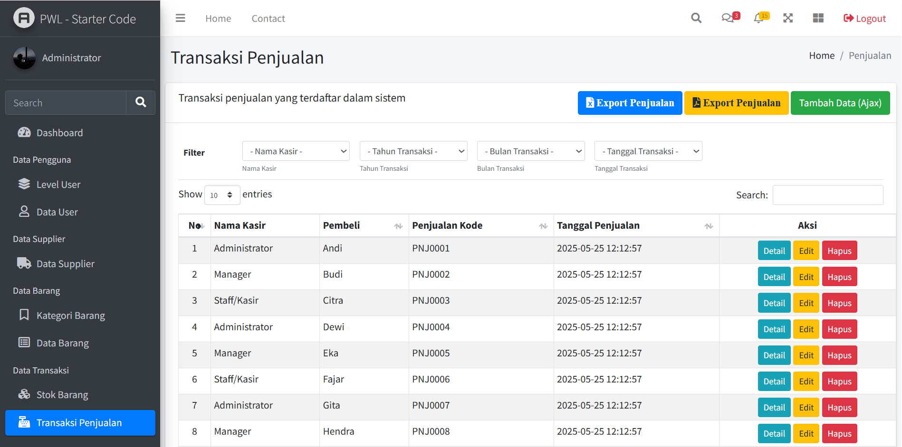

# 🏪 PWL POS - Sistem Point of Sale



## 📋 Deskripsi Proyek

PWL POS (Point of Sale) adalah sistem manajemen penjualan berbasis web yang dirancang untuk membantu bisnis kecil hingga menengah dalam mengelola operasi penjualan mereka. Aplikasi ini menyediakan fitur lengkap untuk manajemen produk, stok, transaksi penjualan, serta pelaporan yang komprehensif.

## ✨ Fitur Utama

### 🔐 Manajemen Pengguna & Akses

-   **Multi-level User Management**: Administrator, Manager, dan Staff/Kasir
-   **Sistem Autentikasi**: Login/logout dengan JWT authentication
-   **Profile Management**: Update profil dan foto pengguna
-   **Role-based Access Control**: Kontrol akses berdasarkan level pengguna

### 📦 Manajemen Master Data

-   **Manajemen Level Pengguna**: Kontrol hierarki akses sistem
-   **Manajemen Kategori Barang**: Klasifikasi produk berdasarkan kategori
-   **Manajemen Supplier**: Data lengkap pemasok barang
-   **Manajemen Barang**:
    -   CRUD operasi lengkap
    -   Upload image produk
    -   Tracking harga dan spesifikasi

### 📊 Manajemen Stok & Inventory

-   **Real-time Stock Tracking**: Monitoring stok barang secara real-time
-   **Stock Movement**: Pencatatan keluar-masuk barang
-   **Low Stock Alert**: Notifikasi stok menipis

### 💰 Sistem Penjualan

-   **Transaksi Penjualan**: Interface yang user-friendly untuk kasir
-   **Multi-item Sales**: Penjualan multiple produk dalam satu transaksi
-   **Invoice Generation**: Generate invoice otomatis
-   **Sales History**: Riwayat transaksi lengkap

### 📈 Pelaporan & Export

-   **Export to Excel**: Laporan dalam format Excel
-   **Export to PDF**: Laporan dalam format PDF
-   **Import Data**: Import bulk data via Excel
-   **Filtering & Search**: Filter berdasarkan tanggal, kasir, dan kriteria lainnya

### 🎨 User Interface

-   **Responsive Design**: Kompatibel dengan desktop dan mobile
-   **AdminLTE Template**: Interface yang modern dan profesional
-   **AJAX Integration**: Operasi tanpa reload halaman
-   **DataTables**: Tabel interaktif dengan sorting dan pagination

## 🛠️ Tech Stack

<div align="center">

### Backend


### Frontend


### Tools & Libraries


</div>

## 🚀 Instalasi

### 1. Clone Repository

```bash
git clone https://github.com/Atadewa/PWL_POS.git
cd PWL_POS
```

### 2. Install Dependencies

```bash
# Install PHP dependencies
composer install

# Install Node.js dependencies
npm install
```

### 3. Environment Setup

```bash
# Copy environment file
cp .env.example .env

# Generate application key
php artisan key:generate

# Generate JWT secret
php artisan jwt:secret
```

### 4. Database Configuration

Edit file `.env` dan sesuaikan konfigurasi database:

```env
DB_CONNECTION=mysql
DB_HOST=127.0.0.1
DB_PORT=3306
DB_DATABASE=pwl_pos
DB_USERNAME=your_username
DB_PASSWORD=your_password
```

### 5. Database Migration & Seeding

```bash
# Run migrations
php artisan migrate

# Run seeders
php artisan db:seed
```

### 6. Asset Compilation

```bash
# Development
npm run dev

# Production
npm run build
```

### 7. Storage Link

```bash
php artisan storage:link
```

### 8. Run Application

```bash
# Development server
php artisan serve
```

Akses aplikasi di: `http://localhost:8000`

## 👤 Default Login

Setelah menjalankan seeder, gunakan akun default berikut:

### Administrator

-   **Username**: admin
-   **Password**: 12345

### Manager

-   **Username**: manager
-   **Password**: 12345

### Staff/Kasir

-   **Username**: staff
-   **Password**: 12345

## 📊 Struktur Database

### Tabel Utama

-   **m_level**: Master level pengguna
-   **m_user**: Data pengguna sistem
-   **m_kategori**: Master kategori barang
-   **m_supplier**: Master data supplier
-   **m_barang**: Master data barang
-   **t_penjualan**: Transaksi penjualan header
-   **t_penjualan_detail**: Detail item penjualan
-   **t_stok**: Tracking stok barang
